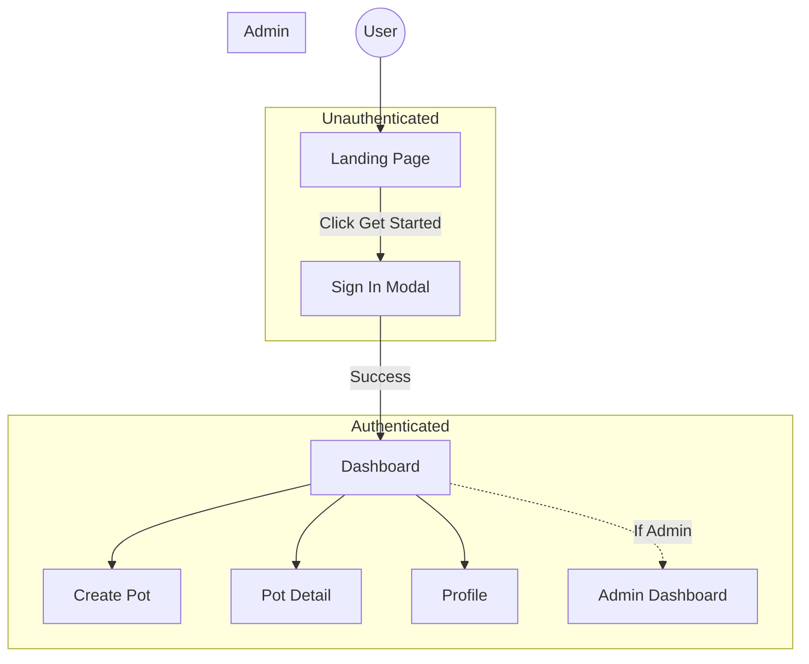
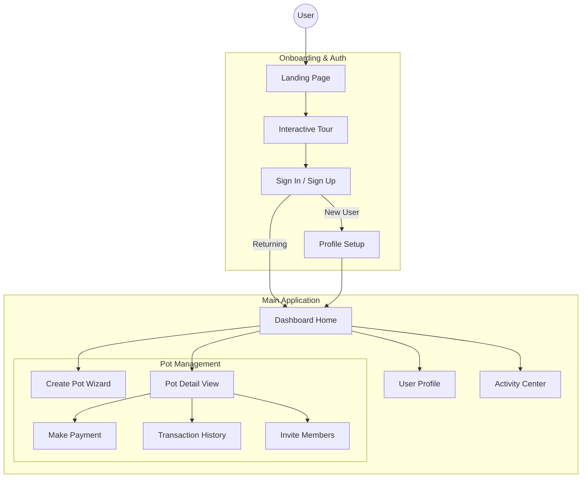

# User Flow Documentation

## 1. Current Application Flow

Based on the current codebase (`src/App.tsx` and `src/pages/`), the application follows this flow:

### public / Unauthenticated

- **Landing Page (`/`)**:
    - Displays "Communal Finance, Reimagined."
    - "Get Started" button triggers Clerk `SignInButton` (modal).
    - Upon successful sign-in, redirects to Authenticated routes.

### Authenticated User

- **Dashboard (`/`)**:
    - Main landing for logged-in users.
    - Likely displays active pots and summary.
    - Navigation to other main sections.
- **Create Pot (`/create`)**:
    - Form to create a new money pot.
- **Pot Detail (`/pot/:potId`)**:
    - Detailed view of a specific pot.
    - Key interaction point for managing a pot.
- **Profile (`/profile`)**:
    - User profile settings and information.
    - Sign out functionality (via `UserMenu`).

### Admin User

- **Admin Dashboard (`/admin`)**:
    - Protected by `AdminRoute`.
    - Functionality for platform administration.

## 2. Proposed User Flow (UI/UX Enhanced)

To elevate the user experience as per "Pro Max" standards, we propose the following refinements:

### Key UX Improvements:
1.  **Onboarding Experience**:
    - Instead of a generic landing, guide users through a "How it Works" quick tour before sign-in.
    - Personalized "Welcome" setup after first login (Avatar, Display Name).
2.  **Streamlined "Create Pot"**:
    - Break down creation into steps (Wizard pattern) to reduce cognitive load.
    - Preview the Pot card before finalizing.
3.  **Interactive Dashboard**:
    - "Quick Actions" floating button (FAB) for common tasks (Pay, View Status).
    - Visual progress bars for Pot cycles.
4.  **Social/Community Features**:
    - Invite flow integration (Share link via native share API).
    - Notifications center for payment reminders and updates.

### Proposed Flow Diagram

## 3. UI Implementation Strategy

Utilizing "Stitch" and modern design principles:

-   **Visuals**: Glassmorphism cards, vivid gradients (as seen in `variable.css` or `index.css`), and micro-interactions (Spring animations).
-   **Typography**: Clean, sans-serif fonts (Inter/SF Pro) with high readability.
-   **Feedback**: Toast notifications for all actions (Success/Error).
-   **Mobile-First**: Bottom navigation bar (already present) optimized for thumb reach.

### Next Steps
1.  Review existing pages against this flow.
2.  Identify missing components (e.g., Wizard, Tour, Notifications).
3.  Design high-fidelity screens for the "Proposed Flow".

## 4. Design System Specification (Generated via ui-ux-pro-max)

To ensure a "Pro Max" quality, we will adopt the **Glassmorphism** style tailored for a Fintech Community app.

### Visual Style: Glassmorphism
-   **Keywords**: Frosted glass, transparent, blurred background, layered, vibrant background.
-   **Best For**: Modern financial dashboards, trust-building, depth.
-   **Key Effects**:
    -   **Backdrop Blur**: `backdrop-filter: blur(12px)` (or `blur-md/lg` in Tailwind).
    -   **Borders**: Subtle 1px solid white with low opacity (`border-white/20`).
    -   **Shadows**: Soft, multi-layered shadows for depth (`shadow-xl` or custom).

### Color Palette
| Role | Color | Hex | Notes |
| :--- | :--- | :--- | :--- |
| **Primary** | Violent Purple | `#7C3AED` | Core brand color, active states. |
| **Secondary** | Soft Purple | `#A78BFA` | Accents, gradients, secondary buttons. |
| **CTA** | Success Green | `#22C55E` | "Join Pot", "Pay Now" actions. |
| **Background** | Pale Purple | `#FAF5FF` | Base background color. |
| **Text** | Deep Purple | `#4C1D95` | High contrast text. |

### Typography
-   **Headings**: **Sora** (Google Fonts).
    -   Weights: 600 (SemiBold), 700 (Bold).
-   **Body**: **IBM Plex Sans** (Google Fonts).
    -   Weights: 300 (Light), 400 (Regular), 500 (Medium).
-   **Mood**: Professional, Trustworthy, Financial, Modern.

## 5. UI/UX Implementation Checklist

Before any PR merge, the following "Pro Max" standards must be met:

### Vital Qualities
-   [ ] **No Emojis as Icons**: Use SVG icons (Lucide React) exclusively.
-   [ ] **Cursor Pointers**: Ensure `cursor-pointer` on *all* clickable elements (cards, rows, etc.).
-   [ ] **Smooth Transitions**: Hover states must transition (`duration-200`), not snap.
-   [ ] **Feedback**: Every action (click, submit) has visual feedback (button loading state, toast).

### Accessibility & Layout
-   [ ] **Contrast**: Text contrast must differ by at least 4.5:1.
-   [ ] **Touch Targets**: Minimum 44x44px for mobile interaction.
-   [ ] **Responsiveness**: Tested on 375px (Mobile), 768px (Tablet), and Desktop.
-   [ ] **Focus States**: Visible focus rings for keyboard navigation.

